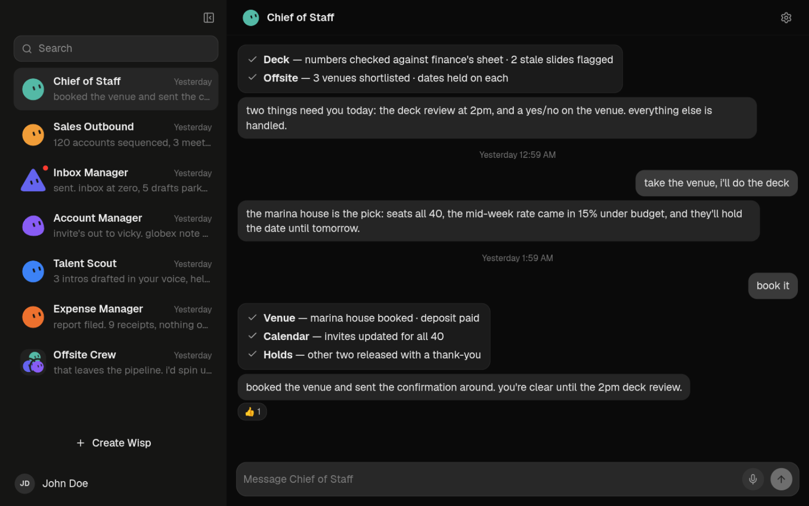

# Wisp Bot

Wisp Bot is an Electron desktop application for running persistent AI-agent
conversations. Each Wisp owns a persistent agent session on the Pi runtime,
with per-Wisp models, plugins, and approval-gated tools, while a sandboxed
Electron boundary owns credentials, sessions, and durable state.

<p align="center">
  
</p>

The renderer uses React 19, TypeScript 7, Vite 8, Tailwind CSS 4, and locally
owned shadcn/ui components with the Base Nova preset.

## Highlights

- **Persistent agent conversations** — one durable Pi session per Wisp, with
  streaming events, retries, and compaction. See [AI models](docs/models.md).
- **Bundled plugins** — Brave Search, Linear, and Firecrawl, connected once and
  granted per Wisp. See [plugins](docs/plugins.md).
- **Remote MCP servers** — Streamable HTTP integrations with header or OAuth
  authentication, granted per Wisp. See [MCP servers](docs/mcp-servers.md).
- **Context and memory** — continuity summaries, explicit new topics, and
  user-maintained saved memory. See [context and memory](docs/context-and-memory.md).
- **Skills** — per-Wisp reusable procedures, saved on request after you
  approve them. See [context and memory](docs/context-and-memory.md#skills).
- **Usage reports** — per-Wisp session reports and a local token/cost
  dashboard. See [token usage](docs/token-usage.md).
- **Approval-gated tools** — encrypted credential storage and per-Wisp tool
  authorization. See [security](docs/security.md).
- **Responsive layout** — a mobile-style single-screen layout below 760px.
  See [mobile layout](docs/mobile-layout.md).

## Getting started

### Prerequisites

- [Node.js](https://nodejs.org/) 22.19 or later
- npm

Install dependencies and start the desktop development environment:

```bash
npm install
npm run dev
```

`npm run dev` starts Vite with React Fast Refresh and opens Electron. The Vite
URL alone is only a renderer preview; it deliberately cannot access the secure
desktop bridge.

For an explicit local fake-agent run that never contacts a provider, start
development with `WISP_AGENT_MODE=fake npm run dev`. Packaged builds ignore
this switch.

Development-only environment variables (all ignored by packaged builds unless
noted):

| Variable | Effect |
| --- | --- |
| `WISP_AGENT_MODE=fake` | Use the deterministic fake agent (unpackaged dev runs only). |
| `WISP_DATA_DIR` | Redirect the user-data directory for unpackaged runs (default `wisp-bot-dev`). |

### Quality gates

```bash
npm test
npm run lint
npm run format:check
npm run typecheck
npm run build
```

Use `npm run format` to apply the repository's Biome formatting rules.
`npm start` runs a production build and opens the locally built Electron
application.

Tests use fake agents and never contact a model provider. CI runs the test,
lint, formatting, typechecking, and build gates. Releases also require
`npm run audit:prod` to pass.

### Optional live Pi smoke

The opt-in smoke test makes one real provider request. It reads the key only
from the process environment, does not print model output or key material, and
removes its temporary session afterward.

```bash
WISP_PI_SMOKE=1 \
WISP_PI_SMOKE_PROVIDER=anthropic \
WISP_PI_SMOKE_MODEL=claude-sonnet-4-5 \
WISP_PI_SMOKE_API_KEY='your-key' \
npm run smoke:pi
```

### Add shadcn components

```bash
npm run ui:add -- card
```

Generated components are written to `src/components/ui/` and are maintained
locally.

## Documentation

| Document | Contents |
| --- | --- |
| [Architecture](docs/architecture.md) | Process boundary, project structure, runtime, data storage |
| [Security](docs/security.md) | Trust boundary, credential storage, tool authorization |
| [AI models](docs/models.md) | Global model settings and per-Wisp overrides |
| [Plugins](docs/plugins.md) | Brave Search, Linear, and Firecrawl connections and access |
| [MCP servers](docs/mcp-servers.md) | Remote MCP integrations, access, and revocation |
| [Context and memory](docs/context-and-memory.md) | Context renewal, summaries, new topics, saved memory |
| [Token usage](docs/token-usage.md) | Session reports and the usage dashboard |
| [Mobile layout](docs/mobile-layout.md) | Responsive single-screen layout below 760px |
| [Application settings](docs/application-settings.md) | App settings, notification sounds, updates, known limitations |
| [Installing on macOS](docs/installing-on-macos.md) | Running unsigned builds under Gatekeeper |
| [Installing on Linux](docs/installing-on-linux.md) | `.deb` and AppImage installation, keyring requirement |
| [Release runbook](docs/release-runbook.md) | Publishing, verification, and rollback for releases |
| [Decision records](docs/decisions/) | Architecture decision records (ADRs) |

## Desktop releases

[GitHub Releases](https://github.com/gustmrg/wisp-bot/releases) has macOS
(arm64 and x64 DMG/ZIP) and Linux (x64 AppImage and `.deb`) builds. Windows is
not built yet.

macOS builds are ad-hoc signed and not notarized, so you have to remove the
quarantine attribute before the first launch. See
[installing on macOS](docs/installing-on-macos.md). Linux builds update in
place from Settings → About. See [installing on Linux](docs/installing-on-linux.md).

To release, run the **Desktop release** workflow from `main` with a version
(`patch`, `minor`, `major`, or an exact version). It runs every quality gate,
packages both platforms, commits the version bump, tags it, and publishes the
release. See the [release runbook](docs/release-runbook.md) and
[ADR 007](docs/decisions/007-release-automation.md). `npm run dist` and
`npm run dist:dir` package the current OS locally without publishing.

## Contributing

Run all quality gates before opening a change. Found a bug or have an idea?
[Open an issue](https://github.com/gustmrg/wisp-bot/issues).

## License

[MIT](LICENSE)
