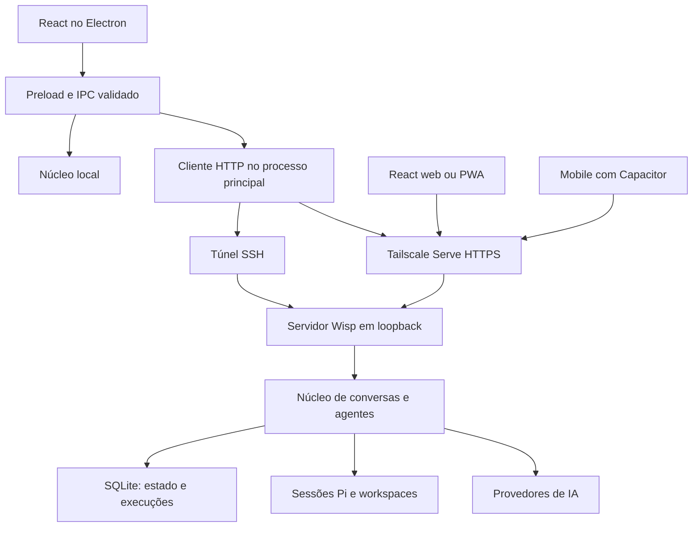

# Plano de implementação: backend remoto, SSH e Tailscale

- Data: 2026-09-07.
- Status: implementação entregue na branch `codex/remote-backend-ssh-tailscale`; validações externas pendentes estão identificadas na seção 16.
- Objetivo: executar o Wisp continuamente em um servidor e acessar as mesmas conversas pelo Electron, navegador e mobile, com conexão SSH e compatibilidade explícita com Tailscale.
- Primeiro marco utilizável: backend Linux persistente + Electron remoto por SSH, SSH sobre Tailscale e HTTPS via Tailscale Serve.
- Marcos seguintes: interface web responsiva/PWA e aplicativo mobile com Capacitor usando a mesma API.

## 1. Resultado esperado e escopo

O servidor será responsável por agentes, histórico, memória, configurações de modelos, credenciais, políticas de ferramentas, aprovações e arquivos dos workspaces. Cada cliente carregará o estado desse servidor e acompanhará suas mudanças. Encerrar um aplicativo, suspender o notebook ou perder o túnel não deverá encerrar os agentes remotos.

A sessão de conversa terá identidade persistente e independente da conexão SSH, do socket de eventos e da janela Electron. Todos os dispositivos conectados à mesma instância verão as mesmas conversas; a sincronização será feita pelo backend, sem replicar arquivos de sessão entre clientes.

### Incluído

- Preservar o modo desktop local existente.
- Servidor Linux sem interface gráfica e sem dependência de Electron.
- Desktop macOS e Windows, acompanhando os alvos de distribuição atuais.
- Um proprietário por instância, com vários dispositivos autenticados e revogáveis.
- SSH convencional, inclusive usando IP privado ou MagicDNS do Tailscale.
- Compatibilidade com o recurso Tailscale SSH, incluindo autenticação interativa exigida por políticas da tailnet.
- Conexão HTTPS ao backend por Tailscale Serve, também utilizável no navegador e no celular.
- Reconexão, continuidade de execução, mensagens sem duplicação por retransmissão, aprovações entre dispositivos e migração do histórico local.
- Implantação, backup, restauração, atualização e diagnóstico documentados.

### Fora da primeira entrega

- Hospedagem pública multiusuário, cobrança, organizações e isolamento entre clientes de um SaaS.
- Vários processos executores compartilhando a mesma instância ou alta disponibilidade automática.
- Execução de ferramentas nos arquivos do computador cliente: os workspaces estarão no servidor.
- Envio automático de mensagens escritas offline. Rascunhos poderão ser preservados localmente.
- Agendamento autônomo novo: manter o comportamento existente de execução e renovação de contexto.
- Instalação silenciosa de Tailscale, mudanças automáticas na política da tailnet ou publicação via Funnel.
- SSH embutido no aplicativo mobile: HTTPS via Tailscale cobre esse acesso no marco mobile.

## 2. Diagnóstico do código atual

| Área | Evidência no repositório | Mudança necessária |
| --- | --- | --- |
| Inicialização e encerramento | `electron/main.ts` cria serviços e os destrói no encerramento do app | Extrair composição do backend; distinguir backend local pertencente ao app de backend remoto independente |
| Serviços de domínio | `electron/backend/conversation-service.ts`, `agent-registry.ts`, `model-service.ts`, `pi-conversation-agent.ts` | Reaproveitar em um núcleo sem imports de Electron |
| Interface e transporte | `src/main.tsx`, `src/lib/wisp-bridge.ts` e vários componentes exigem `window.wisp` | Injetar uma API da aplicação e oferecer adaptadores local/remoto/web |
| Contratos | `shared/contracts.ts` mistura operações de agentes e atualizações desktop | Separar backend, plataforma e gerenciamento de conexões |
| Validação | `electron/ipc/validators.ts` e registradores IPC | Compartilhar validadores de entrada com HTTP sem transportar autoridade de janela para a rede |
| Credenciais | `safe-storage-encryption.ts` implementa `EncryptionService` com Electron | Criar provedor de criptografia para o servidor e manter `safeStorage` no desktop |
| Plugins e integrações | `plugin-service.ts`, `plugin-adapters.ts`, `shared/plugins.ts` e handlers de plugins | Migrar serviços, credenciais e permissões por sessão junto com o runtime; operações externas continuam no servidor |
| Aprovações | `tool-authorization-broker.ts` exige `windowId`; TTL atual de 60 segundos | Autorizar pelo proprietário/dispositivo e persistir decisões, sem exigir janela aberta |
| Idempotência | `AgentRegistry` mantém IDs aceitos somente em memória | Persistir admissão e estado das execuções no servidor |
| Envio de mensagens | `use-conversations.ts` primeiro salva a mensagem e depois chama `sendMessage` | Tornar a admissão uma operação transacional do backend |
| Eventos | Sequência atual reinicia com o processo; o stream cobre principalmente eventos dos agentes | Criar cursor persistente, eventos de mudanças de domínio e recuperação após reinício |
| Persistência | JSON, filas em memória, sessões Pi e caminhos derivados do diretório local | Introduzir armazenamento transacional no servidor e migrador de caminhos/sessões |
| Preferências/política | `use-workspace-controller.ts` copia política para preferências e a grava novamente no backend | Impedir que preferências antigas de um dispositivo sobrescrevam a política remota ao conectar |
| Identidade | `shared/current-user.ts` contém usuário demonstrativo | Obter identidade do proprietário autenticado; separar identidade visual de autorização |
| Política web | `electron/security-policy.ts` usa `connect-src 'none'` em produção | Manter isolamento desktop; criar política específica para o build web |
| Contexto e horário | `context-session.ts` e `shared/context-policy.ts` usam o relógio local do processo | Definir fuso da instância/conversa para que mover ao servidor não altere silenciosamente a renovação diária |

Os limites atuais do runtime devem ser preservados inicialmente: um pedido de provedor por Wisp, até oito comandos pendentes por conversa, quatro agentes executando simultaneamente e prazo de execução de dez minutos. Revisões desses valores exigem decisão própria, não devem ser consequência incidental da migração.

O inventário inclui arquivos de plugins presentes no workspace durante a elaboração. Antes de iniciar a extração, revalidar a versão integrada desses contratos e quaisquer mudanças posteriores; não sobrescrever trabalho em andamento nem congelar a implementação na forma exata observada neste documento.

## 3. Decisões de arquitetura

### 3.1 Núcleo compartilhado e adaptadores

Criar um `backend/` independente de plataforma. A composição receberá dependências explícitas: armazenamento, criptografia, relógio, publicador de eventos, configuração, identidade e logger. O Pi continuará sendo o runtime de agentes, com a versão fixada pelo projeto.

O Electron continuará oferecendo IPC estreito e validado. Em modo local, seus handlers chamarão o núcleo local. Em modo remoto, chamarão um cliente HTTP autenticado no processo principal. Atualizações do aplicativo, conexões SSH e segredos do dispositivo continuarão nesse processo.

O frontend usará uma API injetada. Um adaptador inicial poderá preservar a forma de `window.wisp` para reduzir alterações por etapa, mas o resultado final separará `BackendApi`, `DesktopApi` e `ConnectionApi`. Recursos ausentes serão indicados por capacidades; a web não terá métodos fictícios de instalação de atualizações.



### 3.2 Transportes suportados

| Modo | Caminho | Autenticação de rede | Autenticação Wisp |
| --- | --- | --- | --- |
| Local | Electron → IPC → núcleo local | Limite de confiança Electron | Principal local interno |
| SSH | Electron → OpenSSH → porta loopback do servidor | Chave/agente SSH e identidade do host | Dispositivo pareado, obtido por canal administrativo SSH |
| SSH sobre Tailscale | Mesmo túnel, usando IP Tailscale/MagicDNS | OpenSSH convencional sobre a tailnet | Mesmo pareamento Wisp |
| Tailscale SSH | Túnel por servidor SSH gerenciado pelo Tailscale | Identidade e política Tailscale SSH | Mesmo pareamento Wisp |
| HTTPS sobre Tailscale | Electron/web/mobile → Tailscale Serve → loopback | Rede privada e grants da tailnet | Sessão/dispositivo Wisp pareado |

Tailscale convencional fornece conectividade e nomes MagicDNS; o serviço de destino continua necessário. OpenSSH sobre a tailnet funciona independentemente de habilitar o recurso Tailscale SSH. [Conectividade Tailscale](https://tailscale.com/docs/how-to/connect-to-devices), [MagicDNS](https://tailscale.com/docs/features/magicdns).

Usar HTTP JSON para comandos e consultas e SSE para eventos. O SSE será consumido por `fetch` com parser compartilhado, para permitir cabeçalho de autorização no desktop/mobile e cookies na web. Reconexão e cursor serão controlados pelo cliente; não depender de comportamento implícito de `EventSource`. Manter uma conexão de eventos por cliente, multiplexando conversas. [Formato e funcionamento de SSE](https://developer.mozilla.org/en-US/docs/Web/API/Server-sent_events/Using_server-sent_events).

### 3.3 Persistência e propriedade

- Servidor: SQLite para estado da aplicação, comandos, dispositivos, aprovações e eventos duráveis; arquivos para sessões Pi e workspaces.
- Desktop local: manter o adaptador JSON existente durante a extração. Não incluir a dependência SQLite do servidor no pacote Electron por acidente.
- Uma instância terá um único processo executor e um bloqueio exclusivo do diretório de dados. Um segundo processo deverá falhar de forma explícita.
- SQLite é uma decisão do plano. A biblioteca concreta será fixada na fase 0 após validar Node, Linux x64/arm64, instalação e backup; o restante do código dependerá de interfaces de armazenamento.
- Mensagens e configurações terão uma única fonte autoritativa por instância. Arquivos Pi serão a fonte da continuidade do modelo; não serão tratados como uma réplica bidirecional da base da aplicação.
- `serverId` persistente identifica a instância. `bootId` identifica uma execução do processo. `conversationId`, `sessionId`, `requestId` e `deviceId` não podem depender da porta do túnel.

## 4. Organização proposta

A estrutura abaixo orientou a implementação. O núcleo extraído permanece plano em `backend/` e os validadores estão em `shared/validators.ts`; consulte o ADR 004 para os caminhos finais.

```text
backend/
  bootstrap.ts
  services/                 # conversas, modelos, contexto, relatórios
  agents/                   # registry, Pi, tradutores e fake
  storage/                  # interfaces e adaptadores compartilhados
  authorization/            # política, aprovações e auditoria
shared/
  backend-api.ts
  desktop-api.ts
  connections.ts
  remote-protocol.ts
  validators/
client/
  remote-backend-client.ts
  event-stream.ts
server/
  package.json              # dependências exclusivas do servidor
  main.ts
  cli.ts
  http/
  auth/
  storage/                  # SQLite e migrações
  encryption/
electron/
  connections/              # perfis, OpenSSH, pareamento e reconexão
  backend/                  # apenas adaptadores exclusivos do desktop ao final
  ipc/
src/
  features/backend/         # provider, estado da conexão e capacidades
  features/connections/
  features/auth/
mobile/                     # projeto Capacitor no marco mobile
deploy/
  systemd/
  docker/
  tailscale/
docs/
  remote-server.md
  remote-migration.md
  remote-troubleshooting.md
  decisions/                # novos ADRs, com numeração disponível na implementação
```

Usar workspaces npm somente onde necessários para separar dependências do servidor. Preservar os comandos de desenvolvimento e empacotamento desktop. Adicionar builds separados para núcleo, servidor e web, revisando `rootDir`, includes TypeScript, resolução ESM/CJS e descoberta de testes.

## 5. Protocolo, estado e continuidade

### 5.1 Contrato HTTP versionado

Prefixo `/api/v1`. Cada rota terá esquema de entrada e saída, autenticação, limite de payload e erro sanitizado. Operações desconhecidas ou extras de plataforma não serão expostas por um proxy genérico de nomes IPC.

| Grupo | Rotas propostas | Comportamento |
| --- | --- | --- |
| Saúde | `GET /health/live`, `GET /health/ready` | Liveness e readiness mínimos, sem histórico, identidade ou configurações |
| Negociação | `GET /api/v1/server` | Autenticado; `serverId`, `bootId`, versões de API, capacidades, limites e identidade do proprietário |
| Pareamento/sessão | `POST /api/v1/auth/pair`, `/refresh`, `/logout` | Consumo único de código, credenciais de dispositivo e revogação |
| Dispositivos | `GET /api/v1/devices`, `DELETE /api/v1/devices/:id` | Listar e revogar acesso, inclusive streams ativos |
| Sincronização | `GET /api/v1/snapshot`, `GET /api/v1/events?after=...` | Estado com cursor consistente; stream posterior ao cursor |
| Conversas | `GET/POST /api/v1/conversations`, `PATCH/DELETE /api/v1/conversations/:id` | CRUD validado com revisão esperada nas mutações |
| Histórico | `GET /api/v1/conversations/:id/messages` | Paginação e cursor; não devolver todo o histórico a cada alteração |
| Execução | `POST /api/v1/conversations/:id/messages`, `GET /api/v1/conversations/:id/requests/:requestId`, `POST /api/v1/conversations/:id/abort` | Admissão durável, consulta de resultado e cancelamento explícito |
| Contexto/modelo | `/api/v1/conversations/:id/context`, `/model` | Operações explícitas equivalentes aos contratos atuais, respeitando conversa ocupada |
| Aprovações | `POST /api/v1/approvals/:id/resolve` | Decisão atômica e auditada |
| Configurações | `/api/v1/settings/ai`, `/tool-policy` e remoção de credencial por provedor | Proteger por autorização; respostas nunca retornam credenciais |
| Plugins | `/api/v1/plugins`, `/api/v1/plugins/:id/test`, `/api/v1/conversations/:id/plugin-access` | Configurar/remover/testar integrações e editar grants da sessão com revisão e autorização |
| Relatórios | `/api/v1/usage`, `/api/v1/conversations/:id/session-report` | Reaproveitar modelos de relatório existentes |

As rotas abreviadas de contexto/modelo/configuração devem ganhar métodos e esquemas exatos no contrato da fase 3. Incluir também marcar conversa como lida e responder prompts existentes. Não expor `initializeConversations` como importação implícita de dados do navegador, nem `disposeConversation` como efeito de desconexão. Reservar importação para o fluxo administrativo da seção 11.

Comandos aceitos responderão `202` com `{ requestId, status, revision }` depois da persistência, sem esperar a resposta do provedor. Usar `401` para autenticação ausente/expirada, `403` para acesso negado, `409` para conflito, `413` para payload excessivo e `429` para capacidade excedida. Novos códigos do domínio deverão distinguir transporte indisponível, versão incompatível, cursor expirado, conflito e execução interrompida. `retryable` nunca autoriza sozinho reenviar uma operação com efeitos externos.

### 5.2 Admissão, idempotência e reinício

1. Validar identidade, conversa, modelo, limites e `requestId`.
2. Em uma transação, gravar mensagem de saída, registro de execução `queued`, revisão e evento de admissão.
3. Aplicar unicidade de `(conversationId, requestId)` e associar um hash do payload normalizado.
4. Repetição do mesmo ID/payload retorna a execução existente; mesmo ID com outro payload retorna conflito.
5. O executor adquire o comando e grava `running` antes de invocar o Pi.
6. Estados terminais serão `completed`, `cancelled`, `failed` ou `interrupted`; gravar resultado e evento correspondente de forma consistente.
7. Após reinício, comandos ainda `queued` podem ser executados pela primeira vez; comandos encontrados em `running` devem ser reconciliados com o resultado Pi disponível ou marcados `interrupted`. Não reenviar automaticamente um pedido cujo envio ao provedor é incerto.

Não existe transação única entre SQLite, arquivos Pi e o provedor. O plano garante admissão idempotente e recuperação conservadora, sem prometer execução exatamente uma vez de ferramentas ou chamadas externas após uma falha abrupta. Registrar IDs correlacionáveis para reconciliar resultados; uma nova tentativa explícita terá novo ID e referência à anterior.

Concluir uma chamada HTTP interrompida pelo cliente não deve abortar o comando já aceito. O cliente deve consultar o ID antes de oferecer nova tentativa. Impedir duplicação também quando o primeiro ACK foi perdido.

### 5.3 Eventos e recuperação do estado

- Envelope: `protocolVersion`, `serverId`, `bootId`, `eventId`, `type`, `occurredAt`, `conversationId?`, `requestId?`, `revision?` e payload validado. Cursor opaco representado como string, sem depender do limite numérico de JavaScript.
- Eventos duráveis de domínio: criação/edição/exclusão, mensagens admitidas, checkpoints de resposta, estados de execução, modelo, contexto, política e aprovações.
- Produzir alterações de estado e eventos duráveis na mesma transação. Publicar somente após commit, usando uma outbox para recuperar publicações interrompidas.
- Consolidar deltas de texto em checkpoints limitados, inicialmente a cada 250 ms ou 8 KiB e obrigatoriamente ao terminar. Cada checkpoint persistido recebe cursor; o stream não deve anunciar um cursor que o servidor não consiga recuperar.
- Atividade efêmera de ferramenta e indicadores visuais podem ser coalescidos. O snapshot deve permitir reconstruir seu estado atual, sem prometer replay de cada atualização visual.
- `snapshot` devolverá revisão/cursor obtidos na mesma fronteira consistente. O cliente aplica o snapshot e depois eventos posteriores; eventos recebidos antes da hidratação ficam em buffer limitado.
- O snapshot inicial conterá metadados, revisões, execuções/pendências atuais e uma janela limitada de mensagens da conversa selecionada. Paginar listas e histórico; se for necessário dividir um snapshot, vincular páginas à mesma revisão ou reiniciar a leitura quando ela expirar. Não carregar todos os arquivos e transcripts na memória a cada conexão.
- Retenção inicial proposta: até 24 horas ou 64 MiB de eventos por instância, valendo o limite atingido primeiro. Manter histórico de mensagens separado dessa retenção. Cursor anterior à retenção retorna `resync_required`.
- Detectar lacunas, repetição, troca de instância e restauração de backup. Uma restauração deve invalidar a geração de cursores anterior e exigir snapshot, mesmo que mantenha o `serverId`.
- Conexão lenta não pode bloquear o agente: limitar o buffer por cliente, fechar streams atrasados com instrução de ressincronização e preservar os eventos persistidos.
- Heartbeats a cada 15 segundos e reconexão com backoff exponencial com jitter, limitada a 30 segundos. Ao despertar ou voltar ao foreground, revalidar a sessão e atualizar o estado.

### 5.4 Concorrência e preferências

- Serializar comandos por conversa no backend, inclusive alterações de contexto, exclusão e mudança de modelo.
- Usar revisão esperada em edições de configurações, memória, identidade do Wisp e política. Um dispositivo desatualizado recebe conflito e recarrega a entidade.
- Política, memória, modelo, plugins, seus grants e fuso de renovação pertencem ao servidor. Tema, largura dos painéis, dispositivo de áudio, conversa selecionada e rascunhos pertencem ao cliente.
- Marcação de leitura será compartilhada pelo proprietário na primeira versão; documentar esse comportamento.
- Chaves de cache/rascunho: `serverId + ownerId + conversationId`. Trocar a conexão limpa streams e estado transitório para evitar mistura de instâncias.
- Remover a gravação automática de política remota durante bootstrap. Só uma edição explícita do usuário, com revisão atual, pode persistir política.

## 6. Autenticação, credenciais e ferramentas

### 6.1 Pareamento de dispositivos

Manter autenticação Wisp também em loopback e na tailnet. Endereço privado e cabeçalhos de proxy não serão identidade de aplicação por si só.

- Criar uma interface administrativa local por socket Unix com permissões restritas e validação do usuário do SO. A CLI administrativa usa esse socket; não acessa SQLite diretamente enquanto o serviço está ativo.
- `wispctl` é um nome proposto. Um comando fixo de pareamento, executado sob o usuário autorizado via SSH, solicita um código aleatório de uso único, de pelo menos 128 bits e validade de dois minutos.
- O Electron recebe o código pelo canal SSH e o troca por uma sessão de dispositivo pela API tunelada. Nunca inserir tokens em argumentos do processo, URLs ou logs.
- Para web/mobile por Tailscale Serve, o proprietário gera o código administrativamente e o informa na tela de pareamento. Aplicar limitação de tentativas e consumo atômico.
- A instância possui um proprietário; dispositivos pareados atuam em nome dele. Persistir identidade do proprietário, `deviceId`, nome do dispositivo e escopos. Não usar `DEMO_CURRENT_USER` como autorização.
- Tokens de acesso curtos, inicialmente 15 minutos; credencial renovável por dispositivo, inicialmente 30 dias, com rotação e revogação. Guardar somente hashes de credenciais verificáveis na base. Tratar perda de resposta durante rotação para não bloquear o dispositivo ou reutilizar indefinidamente tokens antigos.
- Electron: credencial renovável em `safeStorage`, acesso em memória no processo principal. Mobile: armazenamento protegido da plataforma. Web: sessão em cookie `HttpOnly`, `Secure`, `SameSite`, sem token em `localStorage`.
- Para web via túnel HTTP local, pareamento e cookie serão exclusivos da origem loopback com proteção de Origin/CSRF e sem inferir confiança por porta. Esse modo é suporte de desenvolvimento; o acesso web distribuído usará HTTPS via Serve.
- Revogar um dispositivo invalida refresh, requisições e stream ativo. Desconectar a interface não revoga o dispositivo nem cancela trabalho; sair da conta revoga a sessão.
- Não confiar automaticamente em `Tailscale-User-*`, `Tailscale-App-Capabilities` ou `X-Forwarded-*`. Uma futura integração de identidade por proxy precisará de configuração e limite de confiança próprios.

### 6.2 Credenciais dos provedores

- Reaproveitar `EncryptionService`, sem importar `safeStorage` no servidor.
- Implementar criptografia autenticada, com identificador de chave e rotação. Usar primitiva padrão de `node:crypto`, com nonce aleatório por gravação; não criar algoritmo criptográfico próprio.
- Chave mestra fornecida por credencial do gerenciador de serviços ou secret montado em runtime, fora da base e do backup ordinário. Documentar permissões e recuperação separada da chave.
- Arquivo persistente conterá apenas ciphertext. Ausência de chave segura deve produzir `secure_storage_unavailable`, sem fallback para texto puro.
- Reconfiguração inicial de chaves de provedores será o caminho padrão na migração; não copiar o ciphertext do `safeStorage` esperando que ele seja portátil.
- Aplicar o mesmo armazenamento protegido às credenciais de plugins. Alterar a conta/chave de uma integração deve preservar a revogação dos grants antigos e o cancelamento das chamadas afetadas previstos no `PluginService`.
- Atualizar o ADR 001 para documentar o novo limite de confiança e o fornecimento de segredo pelo SO. Material temporário de runtime entregue pelo gerenciador de serviços não deve virar arquivo permanente de configuração.

### 6.3 Aprovações e isolamento dos workspaces

- Substituir `windowId` por proprietário autorizado, conversa, chamada e aprovação. Registrar qual dispositivo tomou a decisão.
- Persistir pendência, estado, prazo e decisão. Resolver com compare-and-set para garantir uma única transição terminal, inclusive se dois dispositivos responderem simultaneamente.
- Quando a decisão também altera política, gravar decisão, alteração de regra e auditoria na mesma transação antes de liberar/bloquear a execução.
- Manter TTL de 60 segundos inicialmente. Sem cliente conectado, a ação que exige aprovação permanece pendente até o prazo; depois falha de forma segura. Não transformar desconexão em aprovação.
- Reconectar antes do prazo permite responder em qualquer dispositivo autorizado. Após reinício, invalidar aprovações de execuções interrompidas; não restaurar uma Promise de execução que deixou de existir.
- Revalidar identidade da chamada, argumentos relevantes e caminho antes da execução. Manter contenção de caminhos, tratamento de symlinks, limites de arquivo e precedência `block → ask → allow`.
- O usuário de serviço será dedicado e sem privilégios administrativos. Ferramentas terão acesso somente aos workspaces necessários; não montar o socket Docker ou diretórios de credenciais dentro deles.
- Integrações externas devem preservar grants de leitura/escrita por sessão e revalidá-los antes de agir. Excluir e recriar um Wisp não pode herdar permissões pelo reaproveitamento de `conversationId`; respeitar a identidade de sessão usada pelo serviço de plugins.
- Logs e auditoria conterão IDs, estados, duração e códigos seguros. Prompts, chaves, saída SSH de pareamento, cabeçalhos de autorização e conteúdo de arquivos ficarão excluídos.

## 7. Gerenciamento SSH no Electron

### 7.1 Perfil de conexão

Modelo proposto: `id`, `name`, `kind`, `expectedServerId?`, `endpoint?`, `sshHostAlias?`, `host?`, `port?`, `username?`, `identityFileRef?`, `sshAuthMode`, `remotePort`, `credentialRef?` e `lastConnectedAt?`.

- `kind`: `local`, `ssh` ou `https`.
- Tailscale é uma forma de alcançar a instância; não criar outro protocolo de backend ou duplicar dados por causa do transporte.
- `sshAuthMode`: `openssh` ou `tailscale-ssh`. Não exigir arquivo de chave no segundo modo.
- Preferir aliases de `~/.ssh/config` e agente SSH do SO, respeitando `ProxyJump` já configurado pelo usuário.
- Guardar referências a chaves, sem copiá-las para o projeto ou para preferências do renderer.
- Primeira entrega: uma instância ativa por janela. Perfis adicionais podem ser salvos; agregação simultânea de várias instâncias fica para depois.

### 7.2 Ciclo de conexão

1. Validar perfil e detectar cliente OpenSSH disponível. No Windows, usar OpenSSH instalado no SO; exibir requisito acionável quando ausente.
2. Estabelecer confiança do host: consultar `known_hosts`; host novo exige verificação explícita de fingerprint; mudança de chave interrompe a conexão. Não desabilitar validação para resolver falhas.
3. Solicitar autenticação pelo agente/fluxo seguro do SO. Chave protegida sem agente produz instrução de desbloqueio, sem coletar passphrase no renderer.
4. Criar túnel limitado a `127.0.0.1` no cliente e ao endpoint loopback fixado no servidor, com porta local livre. Tratar conflito de porta com tentativa limitada e limpeza do processo.
5. Usar `ExitOnForwardFailure=yes`, keepalives e processos sem terminal de conversa. Invocar executáveis com vetor de argumentos e `shell: false`; validar host/porta/usuário para evitar injeção de opções.
6. Checar saúde, parear/renovar credencial, negociar protocolo e comparar `serverId`. Um túnel aberto não comprova que o backend está pronto.
7. Carregar snapshot e iniciar eventos. Testar uma consulta autenticada e o stream antes de mostrar “Conectado”.
8. Em falha, encerrar recursos locais pertencentes à conexão, preservar rascunhos e reconectar com backoff. Tratar política SSH negada, autenticação pendente, host desconhecido, backend ausente e versão incompatível como estados distintos.
9. Ao sair do app, encerrar apenas túnel e cliente remoto. A rotina atual de `disposeAll()` não poderá ser chamada no backend remoto.

Comandos administrativos SSH serão fixos e limitados, com dados estruturados enviados por stdin; concatenar um argumento local seguro não basta para tornar seguro o comando interpretado pelo shell remoto. Não aceitar um campo de comando remoto arbitrário na interface.

O backend será instalado como serviço. O cliente poderá consultar seu estado e oferecer iniciá-lo por ação explícita, sem criar um novo backend a cada conexão, sem manter um processo dependente do terminal SSH e sem alterar `sudoers` automaticamente.

Exemplo manual de transporte, após a implementação do servidor:

```bash
ssh -N -T \
  -o ExitOnForwardFailure=yes \
  -o ServerAliveInterval=15 \
  -o ServerAliveCountMax=3 \
  -L 127.0.0.1:18787:127.0.0.1:8787 \
  usuario@servidor
```

O desktop usaria a porta local `18787`; a porta remota continuaria privada. O cliente real escolherá a porta local automaticamente. [Encaminhamento e opções OpenSSH](https://man.openbsd.org/ssh.1).

## 8. Compatibilidade Tailscale

### 8.1 SSH convencional sobre a tailnet

- Instalar e conectar servidor e clientes ao Tailscale pelo fluxo oficial do produto, fora do Wisp.
- Aceitar MagicDNS, FQDN da tailnet, IPv4 e IPv6 nos perfis; não presumir apenas endereços `100.x`.
- Usar o OpenSSH existente no servidor com suas próprias chaves e política de host. Testar com porta configurável e `ProxyJump` quando aplicável.
- Documentar grant de rede até a porta SSH escolhida. O backend continua em loopback e não exige liberar a porta `8787` na tailnet.
- Tailscale desligado, nó sem conectividade e nome não resolvido devem ser erros diagnosticáveis, sem fallback silencioso para outro servidor.

### 8.2 Recurso Tailscale SSH

É distinto de simplesmente executar OpenSSH pela VPN. Na documentação consultada, o destino Tailscale SSH usa porta 22, exige políticas de rede e SSH, e pode solicitar reautenticação por URL no modo `check`. O servidor Linux é o alvo de validação deste plano. [Tailscale SSH](https://tailscale.com/docs/features/tailscale-ssh).

- Testar o túnel com Tailscale SSH em uma tailnet de teste, incluindo política `check`; compatibilidade não estará concluída apenas porque OpenSSH sobre MagicDNS funciona.
- Preservar o fluxo de identidade do Tailscale e não exigir uma chave privada convencional nesse modo.
- Mostrar “Autenticação Tailscale necessária” quando houver desafio. Abrir somente URL HTTPS validada e por ação do usuário no navegador do sistema; nunca renderizar HTML retornado pelo SSH em contexto privilegiado.
- Confirmar forwarding local, reconexão, gerenciamento de host keys e comportamento dos clientes OpenSSH suportados na fase de integração. Se uma combinação não suportar o túnel, documentar a limitação e oferecer HTTPS via Serve ou OpenSSH convencional sobre Tailscale.
- Não ativar Tailscale SSH nem editar regras pelo Wisp. O runbook fornecerá configuração revisável ao administrador.

### 8.3 HTTPS privado com Tailscale Serve

Este será o caminho preferido para web e mobile e uma alternativa de conexão direta no Electron. O servidor Wisp escuta em loopback; Serve publica um endpoint HTTPS acessível na tailnet. [Tailscale Serve](https://tailscale.com/docs/features/tailscale-serve).

Exemplo administrativo, com servidor Wisp em `127.0.0.1:8787`:

```bash
tailscale serve --bg --https=443 http://127.0.0.1:8787
tailscale serve status
```

Usar a URL HTTPS exibida por `serve status`, incluindo o nome completo `.ts.net`. `--bg` mantém a configuração ativa entre reinícios. Verificar habilitação de HTTPS na tailnet conforme solicitado pelo Tailscale. [CLI Serve](https://tailscale.com/docs/reference/tailscale-cli/serve), [HTTPS](https://tailscale.com/docs/how-to/set-up-https-certificates).

- Servir frontend web e `/api/v1` na mesma origem, com URL pública configurada para cookies e validação de Origin/Host.
- Testar streaming SSE sem buffering, heartbeats, reinício de `tailscaled` e retomada pelo cursor.
- Validar certificados normalmente no Electron/mobile; não adicionar opção para ignorar TLS.
- Proteger a aplicação com pareamento Wisp; nesta entrega, não inferir proprietário a partir dos cabeçalhos de identidade do Serve.
- Configuração do Wisp deve aceitar apenas o proxy/Host previsto. O serviço loopback pode receber chamadas locais, por isso autenticação continua obrigatória.
- O runbook não utilizará Funnel. Acesso por dispositivos fora da tailnet não é requisito desta entrega.

Fragmento ilustrativo de política, para mesclar à política existente e validar no console Tailscale:

```json
{
  "groups": {
    "group:wisp-users": ["owner@example.com"]
  },
  "tagOwners": {
    "tag:wisp-server": ["autogroup:admin"]
  },
  "grants": [
    {
      "src": ["group:wisp-users"],
      "dst": ["tag:wisp-server"],
      "ip": ["tcp:22", "tcp:443"]
    }
  ]
}
```

O fragmento concede conectividade de rede, não configura a política do recurso Tailscale SSH. Caso ele seja usado, adicionar regras `ssh` próprias, limitadas ao usuário de serviço permitido, e testes de política. Ajustar a porta 22 se for OpenSSH convencional em outra porta. Regras existentes amplas continuam concedendo acesso: o fragmento não as revoga. [Grants](https://tailscale.com/docs/features/access-control/grants).

## 9. Frontend, desktop e mobile

### Desktop

- Tela “Conexões”: nome, modo Local/SSH/HTTPS, dados de conexão, testar, conectar, desconectar e remover.
- Manter a interface empacotada e o preload restrito. Todo tráfego remoto desktop fica no processo principal, preservando a CSP restritiva do renderer.
- Mostrar nome da instância e estado de conexão no workspace. Separar estado da rede do estado do agente.
- “Desconectar” não deve sugerir que o agente parou. “Parar resposta” continua sendo comando explícito da conversa.
- Mostrar versão incompatível com orientação sobre qual lado atualizar. Não atualizar o servidor automaticamente ao instalar uma versão desktop.
- Ao trocar instância, cancelar assinaturas locais, invalidar respostas atrasadas e recarregar política/modelos/identidade/estado.

### Web/PWA

- Novo entrypoint sem exigir `window.wisp`, usando os mesmos componentes e um `BackendProvider`.
- Build estático servido pelo backend/mesma origem; nenhum segredo em variáveis `VITE_*`, bundle ou service worker.
- Pareamento e sessão por cookie; proteção CSRF em mutações, validação estrita de Origin e Host, CORS fechado por padrão.
- Layout estreito: lista, conversa e detalhes como telas/painéis alternáveis; teclado virtual, áreas seguras e ações por toque.
- PWA armazenará inicialmente apenas assets estáticos. Não cachear respostas autenticadas/histórico no service worker. Rascunhos locais serão separados por instância e poderão ser apagados ao sair.
- Retorno ao foreground exige reconciliar o estado antes de habilitar mutações dependentes de revisão. Instalação PWA e limitações serão testadas em Android e iOS.

### Mobile com Capacitor

- Marco posterior à web responsiva: empacotar os assets locais e reutilizar o cliente HTTPS.
- Conectar a URL Serve com Tailscale ativo no dispositivo; credenciais em armazenamento protegido nativo.
- Configurar origens/capacidades específicas da WebView, sem wildcard de CORS ou redução de TLS. Não embutir o SSH desktop na WebView.
- Validar suspensão prolongada, retorno ao app, mudança Wi-Fi/celular, teclado e perda da VPN.
- Notificações push e execução de conexões em background serão uma evolução separada. A execução no servidor já continuará sem o app ativo.

O Capacitor permite integrar uma aplicação web aos projetos Android/iOS; o empacotamento não elimina as adaptações de interface e autenticação. [Documentação Capacitor](https://capacitorjs.com/docs).

## 10. Operação do servidor

- Distribuir um artefato Node.js versionado, com dependências de produção próprias e sem Electron. Documentar versão Node efetivamente testada, partindo do mínimo atual do projeto e ajustando-o apenas se necessário.
- CLI proposta: `wisp-server serve --host 127.0.0.1 --port 8787 --data-dir /var/lib/wisp`; esses comandos precisarão ser implementados, não existem hoje.
- Serviço `systemd` com usuário dedicado, diretório de estado, diretório de runtime, credenciais do SO, reinício em falha e limites de recursos. Definir unidades e procedimentos separados para instalação e operação sem privilégios.
- `SIGTERM`: parar admissão, drenar por prazo configurável, cancelar trabalho restante de forma explícita, gravar estado e fechar armazenamento. Esse comportamento é exclusivo do encerramento do servidor.
- Boot: obter lock, verificar chave e schema, aplicar migração segura, reconciliar execuções, recuperar sessões e só então indicar readiness.
- Fuso do servidor configurável e persistido; política diária de cada conversa preservada na migração. Tema/fuso de exibição do cliente não alteram o agendamento do backend.
- Logs estruturados e métricas de filas, conexões, reconexões, duração, atraso de eventos e falhas de persistência. Nenhum conteúdo de conversa nas métricas.
- Espaço insuficiente: rejeitar novos comandos antes de aceitar trabalho sem durabilidade e mostrar erro acionável. Não remover histórico silenciosamente para liberar espaço.
- Docker opcional, após validação em `systemd`: imagem sem root, volume persistente e porta publicada explicitamente em loopback no host. Se Node escutar `0.0.0.0` dentro do container para permitir o mapeamento, isso não autoriza publicar a porta em todas as interfaces do host.
- Não executar duas imagens/unidades sobre o mesmo diretório. Usar o mesmo caminho operacional de migração, backup e shutdown em ambos os formatos.

## 11. Migração, backup e rollback

### Migração local → servidor

1. Gerar inventário versionado de conversas, sessões, memória, políticas, modelos, limites e caminhos. Oferecer dry-run com contagens e avisos sem conteúdo sensível.
2. Pausar novas operações locais e aguardar/cancelar execuções por ação explícita antes de exportar. Exportar em estado consistente.
3. Criar pacote com manifest, versão, checksums e IDs, incluindo conversas, sessões Pi, configuração de contexto/memória e workspaces necessários. Excluir chaves de provedor e credenciais do dispositivo.
4. Transferir por SFTP/SCP ou canal HTTPS autenticado. Preservar a origem local como backup; a importação não deve apagá-la.
5. Importar em staging. Validar tamanho, schema, IDs, colisões, extração de arquivo, caminhos relativos, symlinks e contenção antes de mover para a área ativa.
6. Tratar `piSessionFile` e metadados `cwd` presentes nas sessões: mapear a raiz antiga para o novo diretório e preservar a árvore de sessão/compaction. Não fazer substituição textual indiscriminada dentro de mensagens.
7. Reconfigurar chaves no servidor pelo canal autenticado. Conversas sem provedor aparecem como `configuration_required`.
8. Validar contagens, mensagens, modelo, memória, contexto, relatórios de uso e recuperação Pi antes de trocar a conexão ativa.
9. Importação repetida do mesmo pacote será detectada por ID/checksum e não criará duplicatas. Destino não vazio exige estratégia explícita, inicialmente importar em nova instância ou rejeitar colisão.
10. Não executar `initializeConversations` automaticamente com o `localStorage` de um cliente remoto. Uma nova conexão nunca importa dados sem escolha explícita.

Incluir configurações não secretas de plugins no inventário/exportação. Reconfigurar suas credenciais no destino; manter integrações e permissões desativadas até confirmar a conta de destino e remapear os grants para as sessões importadas, sem transportar autorizações para outra conta implicitamente.

### Backup e restauração

- Backup consistente de SQLite, sessões Pi e workspaces durante janela sem novas execuções e com agentes quiescentes. Copiar somente o arquivo SQLite ignorando WAL não constitui backup válido.
- Definir comando administrativo que coloca a instância em manutenção, aguarda trabalho, cria snapshot e retoma admissão; falha em obter consistência deve abortar o backup com explicação.
- Criptografar o arquivo de backup e manter cópia fora do servidor. Documentar custódia separada da chave mestra e procedimento de teste de restauração.
- Restauração em diretório separado, verificação de integridade e permissões, invalidação da geração de cursores e reconciliação das execuções. Escolher explicitamente revogação de dispositivos quando o backup não for confiável/recente.
- Validar restauração com leitura de histórico e continuidade Pi usando fake; chamadas reais de provedor serão opt-in.

### Atualização e rollback

- Negociação de protocolo antes de permitir comandos. Minor aditivo com capacidades; major incompatível bloqueia operações com mensagem clara.
- Manter compatibilidade da API v1 durante a primeira série de entregas. Não presumir que desktop e servidor serão atualizados juntos.
- Antes de schema upgrade: backup, teste de migração e documentação da versão mínima que lê o novo schema.
- Rollback de binário apenas quando o schema for compatível; caso contrário, restaurar snapshot completo para outra instância. Descrever a perda de alterações posteriores ao snapshot antes dessa operação.
- Modo local continua disponível com seus dados próprios. Voltar ao modo local não incorpora automaticamente conversas criadas no servidor.

## 12. Etapas de implementação

Cada fase deve ser uma mudança revisável com critérios de aceite próprios. Não agrupar toda a migração em um único PR. Os nomes dos PRs abaixo são sugestões de escopo, não pedidos de criação nesta tarefa.

### Fase 0 — Contratos, dependências e provas de compatibilidade

- [x] Registrar ADR de backend remoto e atualizar o limite de confiança do ADR 001.
- [x] Fechar schemas de conexão, identidade, capacidades, protocolo, revisão e erros.
- [x] Revalidar o inventário de contratos na versão de código usada para implementação, incluindo plugins e ferramentas acrescentados desde a elaboração deste plano.
- [x] Validar extração Pi em Node Linux sem Electron e sem ambiente gráfico.
- [x] Selecionar e fixar driver SQLite, framework HTTP e parser SSE com teste pequeno de build, streaming e shutdown. Preferir dependências mantidas, com instalação compatível com Linux x64/arm64.
- [ ] Verificar a matriz OpenSSH macOS/Windows → Linux, inclusive forwarding e agente de chaves.
- [ ] Confirmar serviço de destino, forwarding e desafio `check` em Tailscale SSH; registrar versões testadas e eventuais limitações.

**Aceite:** decisões registradas; prova fake de Node + persistência + stream funciona; nenhum requisito SSH/Tailscale está baseado apenas em suposição.

### Fase 1 — Extração do núcleo preservando desktop local

- [x] Mover serviços e agentes para `backend/` sem alterar semântica de domínio.
- [x] Incluir `PluginService`, adaptadores e validadores de plugins na extração, preservando sua revogação e autorização por sessão. **N/A nesta base:** o subsistema de plugins não está em `main` (0271ca1); não foi importado de outra branch.
- [x] Injetar caminhos, criptografia, identidade, autorização e publicador.
- [x] Mover validações reutilizáveis para `shared/validators/`.
- [x] Adaptar IPC e corrigir separação entre remover handlers e destruir agentes.
- [x] Ajustar TypeScript, build, imports de testes e smoke Pi.

**Aceite:** desktop local mantém testes e comportamento; bundle do servidor não importa Electron; encerramento local continua liberando o runtime que pertence ao app.

### Fase 2 — Estado durável e execuções recuperáveis

- [x] Implementar adaptadores SQLite, migrações, lock e transações.
- [x] Tornar admissão de mensagem/execução única e idempotente.
- [x] Persistir revisões, aprovações, checkpoints e outbox.
- [x] Implementar reconciliação de `queued`/`running` após crash.
- [x] Criar snapshot consistente e retenção de eventos.

**Aceite:** ACK perdido, reinício e dois clientes não duplicam admissão; nenhum trabalho de estado incerto é reenviado automaticamente; uma segunda instância não abre o mesmo diretório.

### Fase 3 — API autenticada, stream e cliente compartilhado

- [x] Implementar rotas versionadas, serialização, autenticação e limites.
- [x] Cobrir catálogo/configurações/grants de plugins e transmitir suas mudanças aos clientes; testes de conexão não retornam chaves nem respostas cruas da integração. **N/A nesta base:** o subsistema de plugins não está em `main` (0271ca1); não foi importado de outra branch.
- [x] Implementar pareamento administrativo, dispositivos, refresh e revogação.
- [x] Implementar SSE, cursor, ressincronização, backpressure e cliente `fetch`.
- [x] Adicionar metadados de servidor/capacidades e compatibilidade de versões.
- [x] Separar dados de apresentação de dados privilegiados; validar saída além da entrada.

**Aceite:** dois clientes de teste consultam e alteram a mesma instância; revogação fecha acesso; respostas/erros/logs não vazam segredos; stream recupera estado após reconexão.

### Fase 4 — Aprovações, configurações e autoridade do servidor

- [x] Trocar autorização por janela por principal/dispositivo.
- [x] Resolver aprovação atomicamente e revalidar ação antes de executar.
- [x] Remover propagação automática de política das preferências locais.
- [x] Configurar identidade real e fuso de renovação de contexto.
- [x] Implementar criptografia de credenciais e ausência segura de chave mestra.

**Aceite:** aprovação em dois dispositivos executa no máximo uma vez; sem clientes o pedido expira; preferências antigas não sobrescrevem a política; credenciais permanecem protegidas no servidor.

### Fase 5 — Serviço e operação headless

- [x] CLI, socket administrativo, flags e configuração de dados.
- [x] Unidade `systemd`, permissões, chave de runtime, readiness e shutdown.
- [x] Artefato de produção sem dependências desktop e smoke de instalação limpa.
- [x] Documentar diagnóstico, atualização e recuperação.

**Aceite:** reiniciar o servidor recupera estado; fechar a sessão SSH de administração não encerra o serviço; o runtime funciona sem X11/Wayland/keyring de desktop.

### Fase 6 — Conexão remota no Electron

- [x] Implementar perfis e `ConnectionManager` com estados explícitos.
- [x] Criar adaptador remoto no processo principal, mantendo IPC estreito.
- [x] Integrar OpenSSH, confiança de host, agente, pareamento e túnel.
- [x] Implementar conexão HTTPS direta com credenciais protegidas.
- [x] Criar tela de conexão, identificação da instância, diagnóstico e reconexão.
- [x] Separar encerramento remoto de `disposeAll()` e proteger troca de conexão contra respostas tardias.

**Aceite:** iniciar resposta, fechar o Electron e reabrir mostra a mesma execução/histórico; SSH funciona em macOS e Windows; modo local continua disponível.

### Fase 7 — Tailscale ponta a ponta

- [ ] Testar OpenSSH por MagicDNS e IPs Tailscale.
- [x] Integrar estados de autenticação do Tailscale SSH e política `check`.
- [x] Preparar Serve, política de acesso de exemplo e runbook de HTTPS.
- [ ] Validar certificado, streaming e autenticação Wisp via Serve no Electron.
- [ ] Exercitar Tailscale desligado, permissão negada, reinício do daemon e reconexão.

**Aceite:** três caminhos validados separadamente: SSH comum sobre tailnet, Tailscale SSH e HTTPS Serve. Apenas a porta SSH/HTTPS prevista fica acessível aos membros autorizados; a API remota permanece em loopback no host.

### Fase 8 — Migração e primeira entrega remota

- [x] Implementar exportação/importação versionada com dry-run e checksums.
- [x] Migrar caminhos de sessões Pi e configuração de contexto.
- [x] Implementar backup/restore e política de compatibilidade de schema.
- [x] Executar migração de fixture representativa e restauração independente.
- [x] Preparar imagem Docker opcional depois de validar o serviço nativo.
- [x] Atualizar README e runbooks, distinguindo comandos implementados de exemplos.

**Aceite:** histórico local pode ser transferido e retomado no servidor, com origem preservada, sem duplicatas nem necessidade de copiar credenciais não portáteis. Este marco conclui desktop remoto + SSH + Tailscale.

### Fase 9 — Web responsiva e PWA

- [x] Introduzir `BackendProvider` e substituir dependências diretas de `window.wisp` nos componentes restantes.
- [x] Separar recursos desktop por capacidades e criar entrypoint web.
- [x] Implementar sessão web, pareamento, CSRF e build servido na mesma origem.
- [x] Adaptar layout, foco, teclado, navegação e rascunhos para dispositivos estreitos.
- [x] Adicionar manifest/service worker restrito a assets e testes Android/iOS.

**Aceite:** iniciar conversa no Electron e continuar no navegador/celular pela URL Serve funciona; ambos recebem edições, mensagens e aprovações da mesma instância.

### Fase 10 — Aplicativo mobile

- [x] Criar projeto Capacitor Android/iOS e armazenamento seguro de sessão.
- [x] Configurar origem da WebView e cliente HTTPS para a URL da instância.
- [ ] Validar background/foreground, expiração de sessão e transição de redes.
- [x] Compilar APK Android de teste e documentar requisitos Tailscale.
- [x] Compilar aplicativo iOS para simulador na CI, incluindo o plugin Keychain.
- [ ] Assinar e instalar o aplicativo iOS de teste em aparelho físico.

**Aceite:** app instalado usa o mesmo backend, recupera resposta produzida durante suspensão e não inclui credenciais de provedor. Publicação em lojas será uma operação posterior explícita.

## 13. Matriz de testes e critérios globais de aceite

Testes automatizados usarão o fake agent e servidores/SSHD de teste. Nenhum teste de rotina consumirá créditos de provedores. A validação Tailscale real exigirá uma tailnet de teste; se o ambiente não estiver disponível, registrar essa etapa como pendente em vez de declarar compatibilidade concluída.

| Cenário | Resultado exigido | Camada |
| --- | --- | --- |
| Desktop local após extração | Comportamento e gates atuais preservados | Unitário/integração/Electron |
| Servidor sem Electron/display | Inicialização, mensagem fake e histórico persistente | Build/smoke Linux |
| Fechar Electron durante resposta | Agente remoto continua e resultado reaparece | E2E |
| Perder túnel antes/depois do ACK | Consulta/reenvio do mesmo ID não duplica trabalho | Integração/E2E |
| Mesmo ID com payload diferente | Conflito e nenhuma nova execução | Integração |
| Dois clientes enviando | Ordem e limites por conversa preservados | Integração |
| CRUD em outro dispositivo | Lista, configurações e estado atualizados | E2E |
| Duas aprovações concorrentes | Uma decisão terminal e uma execução autorizada | Integração |
| Aprovação sem cliente | Expiração, sem execução da ação bloqueada | Integração |
| Reinício com aprovação pendente | Pendência antiga não autoriza trabalho novo | Integração |
| Crash antes/depois da chamada Pi | Reconciliação conservadora, sem replay incerto | Injeção de falhas |
| Cursor expirado/lacuna/reinício | Snapshot e retomada sem perder mensagens duráveis | Integração |
| Cliente muito lento | Buffer limitado; agente e outros clientes continuam | Integração |
| Preferência antiga de política | Nenhuma gravação automática no servidor | Unitário/E2E |
| Plugin revogado/chave alterada durante execução | Cancelamento/revalidação e nenhuma herança de grants por nova sessão ou conta | Integração |
| Perfil/servidor trocado | Sem mistura de mensagens, rascunhos ou credenciais | E2E |
| Host SSH novo/alterado | Verificação explícita/bloqueio de alteração | Integração/Electron |
| Chave com passphrase/agente ausente | Fluxo acionável sem expor passphrase | Manual/Electron |
| Parâmetros SSH maliciosos | Nenhuma injeção de shell, opção ou destino | Unitário/integração |
| OpenSSH sobre Tailscale | MagicDNS, IP e encaminhamento funcionam | Tailnet real |
| Tailscale SSH com `check` | Desafio, túnel e reconexão verificados | Tailnet real |
| Tailscale Serve | HTTPS válido, SSE contínuo e sessão Wisp | Tailnet real |
| Cliente sem grant/dispositivo revogado | Rede ou aplicação nega acesso, conforme a camada | Tailnet/integração |
| Header de identidade forjado | Nenhuma elevação de autoridade | Integração |
| CSRF/Origin/Host/CORS incorretos | Mutações e streams rejeitados quando aplicável | Integração web |
| Provedor sem chave mestra | Falha segura; sem arquivo de segredo em texto puro | Integração |
| Segredos em falhas/logs | Nenhum vazamento de tokens, prompts ou chaves | Testes de redaction |
| Segundo processo mesmo data dir | Inicialização recusada | Integração Linux |
| Disco cheio/migração interrompida | Falha explícita e dados anteriores recuperáveis | Injeção de falhas |
| Importação com caminhos/symlinks inválidos | Nenhuma escrita fora de staging/workspace | Integração |
| Importar duas vezes/restaurar backup | Sem duplicatas; cursores invalidados corretamente | Integração |
| Mobile suspenso e VPN interrompida | Recupera estado no foreground, sem reenviar prompt | Manual Android/iOS |
| Cliente/servidor incompatíveis | Mensagem de atualização, sem mutações parciais | Integração |

Gates do repositório continuam obrigatórios para mudanças de runtime: `npm test`, `npm run lint`, `npm run format:check`, `npm run typecheck` e `npm run build`. Adicionar testes/build do servidor à CI Linux e uma matriz de integração SSH/empacotamento desktop adequada a macOS/Windows. O gate de Tailscale real deve ser manual ou em ambiente isolado com credenciais próprias, sem habilitar publicação externa.

## 14. Riscos e tratamento

| Risco | Tratamento planejado |
| --- | --- |
| Mover arquivos sem realmente remover dependências Electron | Teste de build/start do servidor sem Electron instalado |
| Backend morrer ao desconectar | Propriedade explícita do lifecycle; serviço independente; teste E2E |
| Duplicar chamadas após falha de rede | Admissão persistida, consulta por ID e estado `interrupted` para incerteza |
| SQLite e sessões Pi divergirem após crash | IDs correlacionáveis, recuperação conservadora e testes em pontos de falha |
| Perder cursores após restart/restore | Cursor durável, geração de stream e ressincronização obrigatória |
| Tratar Tailscale como autorização suficiente | Pareamento Wisp e revogação por dispositivo, além dos grants |
| Integrar só OpenSSH e declarar Tailscale SSH suportado | Critérios de aceite e testes separados, com versões registradas |
| Segredo criptografado ficar sem chave recuperável | Procedimento de custódia/backup separado e teste de restauração |
| Compartilhar workspaces ampliar acesso a arquivos do host | Usuário dedicado, contenção e revisão de mounts/permissões |
| Pacote servidor contaminar distribuição desktop | Dependências/builds separados e inspeção dos artefatos |
| Preferências de cliente alterarem regras remotas | Propriedade de servidor e revisão nas mutações |
| Subestimar mobile | Marco próprio para layout, credenciais, suspensão e rede |

## 15. Referências e manutenção do plano

A referência Hermes confirma o padrão de desktop conectado a instâncias remotas por SSH, com túnel e token de aplicação. O Wisp adotará um serviço persistente independente do cliente como decisão própria; não dependerá de detalhes internos do Hermes nem prometerá o mesmo ciclo de vida dos seus processos. [Conexões do Hermes Desktop](https://hermes-agent.nousresearch.com/docs/user-guide/multi-connection-desktop).

Fontes técnicas foram consultadas em 2026-09-07 e estão vinculadas às decisões correspondentes. Durante a fase 0, registrar versões efetivamente testadas de Node, Pi, OpenSSH, Tailscale e bibliotecas escolhidas. Atualizar este plano quando uma decisão mudar; marcar checkboxes somente com evidência de implementação e validação, sem confundir documentação com entrega funcional.

## 16. Registro da implementação e evidências

Implementação iniciada a partir de `origin/main` em `0271ca1c85c2443ea11a68ed8b2e9f20ff37e09e`, em checkout isolado. O plano foi preservado em `plans/`; [ADR 004](../docs/decisions/004-remote-instance.md) registra as decisões finais e a extensão do limite de confiança do ADR 001. Os itens marcados N/A dependiam de plugins existentes somente em outra branch do workspace.

Entregas no código:

- `backend/`, `shared/backend-api.ts`, `shared/desktop-api.ts`, `shared/connections.ts` e `shared/remote-protocol.ts`: núcleo e contratos separados; modo local preservado.
- `server/`: SQLite nativo do Node 24, processo único, fila/admissão durável, snapshots e paginação, outbox/SSE, autenticação de dispositivos/cookies/CSRF, aprovações auditadas, criptografia e rotação, CLI administrativa, transferência/backup/restore.
- `client/` e `electron/connections/`: cliente HTTP, reconciliação, perfis, OpenSSH com confiança explícita, pareamento, HTTPS e estados de autenticação Tailscale; desconexão não encerra runtime remoto.
- `src/features/backend`, `auth`, `connections`, `mobile`, `drafts`; `web/` e `mobile/`: API injetada, sessão web, PWA de assets, navegação estreita, rascunhos por servidor, Capacitor e armazenamento Keychain/Keystore.
- `deploy/`, `scripts/package-server.mjs`, `scripts/server-runtime-smoke.mjs`: pacote sem Electron, imagem Docker, unidade systemd de usuário e exemplos Tailscale. Runbooks em `docs/remote-*.md`.

Evidências coletadas localmente em 2026-09-07:

| Área | Evidência |
| --- | --- |
| Gates finais | 335 testes em 74 arquivos, sem skips, com `WISP_TEST_SSHD=1 npm test -- --maxWorkers=4`; lint, formatação, typecheck, build completo e `dist:server` aprovados; auditoria das dependências de produção da aplicação e do pacote servidor sem vulnerabilidades reportadas |
| HTTP, durabilidade, autorização, eventos | Testes reais contra servidor fake: idempotência/ACK perdido, dois dispositivos, reinício, replay, revogação, revisão concorrente, limite de fila, aprovação disputada, rollback, retenção e redaction |
| Recuperação após falha | Bloqueio exclusivo de instância validado com processos separados, `SIGKILL` e PID reutilizado; pedido sem confirmação mantém o mesmo ID após retry e reload, com três POSTs e uma única execução |
| Transferência | Fixtures com Pi JSONL/workspace; rebase sem substituir texto, todas as páginas de histórico, metadados, dry-run, backup/restore independente, chaves incorretas, adulteração, traversal e symlink |
| OpenSSH | macOS/OpenSSH 9.9p2 com sshd temporário real: host desconhecido, fingerprint incorreto/correto, autenticação por chave, túnel, pareamento e HTTP/SSE; `WISP_TEST_SSHD=1` |
| Linux headless | Imagem Node 24.18.0 Debian Linux arm64 construída; smoke sem rede/sem Electron com catálogo Pi real, criação/reabertura de sessão Pi e serviço/CLI autenticados |
| Web/PWA | Dois testes E2E aprovados, em Chromium e WebKit contra HTTPS local e servidor real: dois clientes, reconexão offline sem duplicata, histórico paginado, conflito de edição, layout de celular, cookies/CSRF, ausência de tokens no storage, cache somente de assets e logout |
| Android | APK debug compilado com JDK 21, Android SDK 36 e plugin Keystore incluído |
| iOS | Compilação CI para simulador aprovada em macOS, com `WispSecureSessionPlugin.swift` e `WispViewController.swift` em arm64/x86_64 |
| CI adicionado | Testes/builds, SSH real, Chromium/WebKit, runtime Linux x64/arm64 e compilação Android/iOS |

Uma revisão independente com `codex review --uncommitted` identificou dois problemas de prioridade alta: novo ID ao repetir uma admissão sem confirmação e falso bloqueio de instância após reutilização de PID. Ambos foram corrigidos e cobertos pelos testes de regressão descritos acima. A sincronização também passou a repetir snapshots quando chegam eventos durante uma leitura em andamento, preservando o cursor mais recente.

A CI do PR confirmou também a instalação e o smoke do runtime independente em Linux x64/arm64. A validação com `actionlint` encontrou uma expressão de permissão inválida herdada no workflow de release; a permissão OIDC passou a ser estática no job de empacotamento, mantendo o login Azure condicionado ao Windows.

Pendências de validação externa, sem simular sucesso:

- O servidor de testes autorizado na tailnet foi alcançado, mas rejeitou a chave SSH disponível (`Permission denied`). A identificação de uma chave/alias autorizado foi solicitada. Não houve instalação nem alteração da tailnet. O fluxo real Tailscale SSH `check`, Serve, MagicDNS/IP e reinício do daemon permanece por executar nesse ambiente.
- Não há host Windows nesta sessão para a matriz real OpenSSH/agent; contratos e compilação são cobertos, mas isso não substitui o teste de execução no Windows.
- A compilação iOS foi validada pela CI após o ambiente local não conseguir baixar a plataforma por espaço insuficiente. Assinatura e instalação em iPhone não foram executadas.
- Background/foreground e transições Wi-Fi/celular/VPN em aparelhos físicos exigem dispositivos e tailnet autorizados; testes de browser/reconexão e código de lifecycle não substituem essa evidência.

Essas pendências são testes de ambiente/distribuição, não atalhos na autenticação: não foi relaxada verificação de certificado/host, não foram adicionadas credenciais ao repositório, e nenhum acesso foi presumido a partir do tempo de espera.
